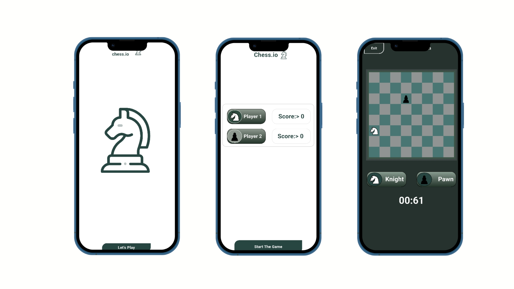

♟️ Flutter Chess Challenge – AI vs Player

Flutter Chess Challenge is a lightweight Flutter application that lets users play chess against an AI opponent.
The app focuses on algorithmic problem-solving, data structures, and small chess challenges, making it perfect for practicing strategic thinking and coding logic.

What This App Solves

Provides a mini chess experience for players who want quick challenges

Implements AI algorithms to simulate intelligent opponents

Demonstrates algorithmic thinking using chess moves and strategies

Serves as a practice tool for data structures and logic in game development

Key Features

Player vs AI Mode
Play against the AI with varying difficulty levels based on algorithm depth.

Algorithm-Driven Moves
Chess logic implemented using data structures (lists, trees) and algorithms for move calculation.

Challenge Levels
Small chess puzzles and challenges to test strategy skills against the AI.

Clean & Minimal UI
Focused on functionality, clarity, and ease of use.

Cross-Platform
Runs on Android, iOS, and web with responsive design.

Skills & Learning Outcomes

This project demonstrates my ability to:

Implement chess algorithms and AI decision-making in Flutter

Use data structures effectively for game logic

Create scalable and clean code architecture for small games

Design a minimal, user-friendly interface for quick gameplay

Tech Stack

Flutter – Cross-platform UI

Dart – Logic and algorithms

AI Algorithms – Chess move calculation and challenges

Data Structures – Lists, arrays, trees, and custom structures for game state

Clean UI Design – Simple and minimal design for gameplay

What This Project Demonstrates

Building small AI-powered games in Flutter

Implementing chess logic with algorithms and data structures

Creating challenge-based gameplay

Writing clean, scalable, and maintainable code

## 📸 Screenshots

Explore the Chess Game app with these screenshots:

## 🎥 Demo Chess Game 

Try the Chess Game demo: [Click here to view](https://drive.google.com/file/d/1-8gvVgjKnG1yKA9GCFHws6TlYWfnY-27/view?usp=drive_link)
